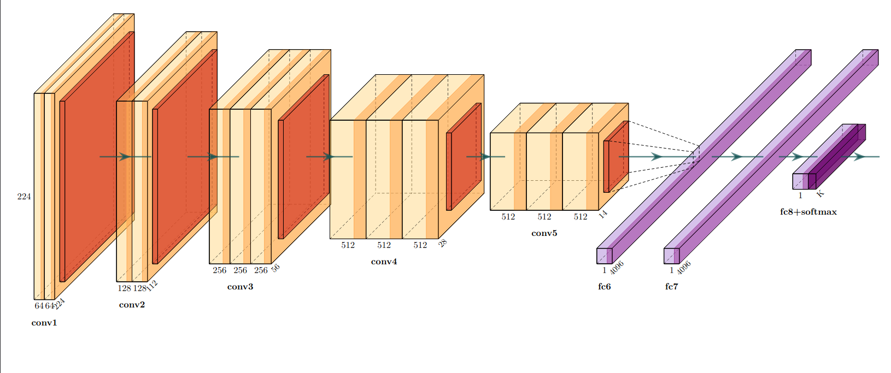
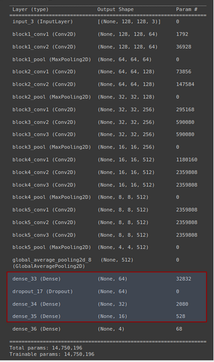
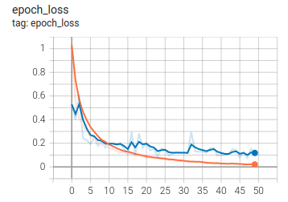
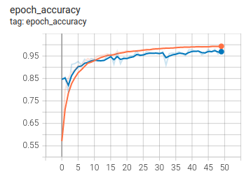
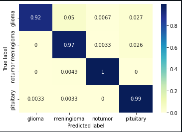
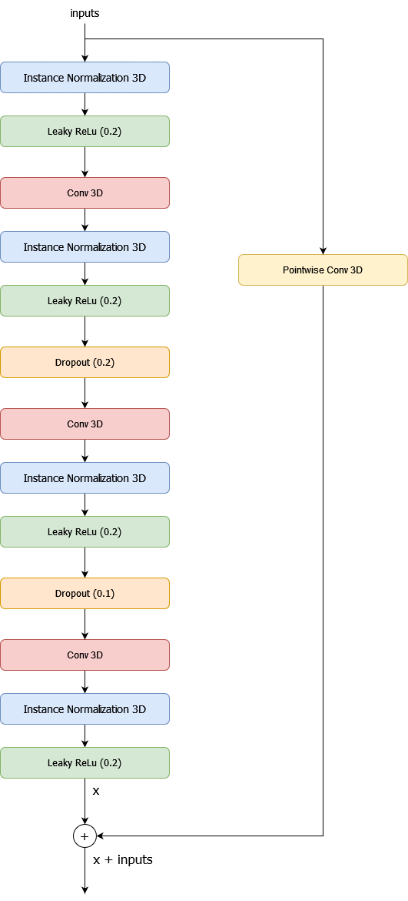
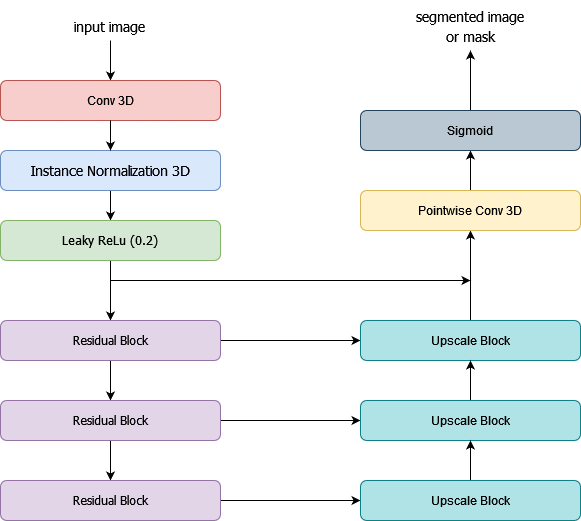
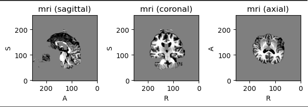
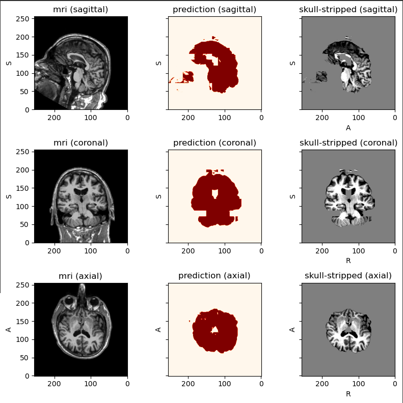

# Classification, Skull Stripping and Segmentation of Brain Tumor MRI

Projet : LIFPROJET 

UE page : http://cazabetremy.fr/wiki/doku.php?id=projet:presentation

Professor in charge : [Alexandre Meyer](https://liris.cnrs.fr/page-membre/alexandre-meyer)

## 1. Abstract

## 2. Introduction
Classification and segmentation of brain tumors are important tasks in the field of medical image analysis. These
techniques are used to accurately identify and locate tumors within brain images, which can help doctors diagnose and
treat patients with brain cancer. The classification of brain tumors involves assigning a specific type or category to a
tumor based on its characteristics, such as its size, shape, and appearance. Segmentation, on the other hand, involves
identifying the exact location and boundaries of a tumor within an image. Both tasks are typically performed using
specialized algorithms and software tools that are designed to analyze medical images and extract relevant information.
By accurately classifying and segmenting brain tumors, doctors can make more informed decisions about a patient’s
treatment and care. But to improve this segmentation and the doctors’ decisions, it is necessary to process as much data
as possible and remove what is not useful, such as the skull. The skull stripping allows first of all a better visual view of
the brain but also to reduce the errors of the segmentation. It is usually the radiologist’s job to do this, but it is a fastidious
and repetitive job that requires time and concentration. And like any repetitive work, it is possible to program it.

### Download link for models
To use the notebooks, you must first download the models and put them in their directory. We can't put them on the git because they are too big.
- [**MobileNetV2_SGD_kl_divergence_50_2.h5**](https://drive.google.com/file/d/1-hlyTvrkRXsQehPKeNWGATZGY-BWGcRj/view?usp=share_link) :
Path of the directory to paste : [Classification/models-classification](Classification/models-classification)
- [**ResidualUNET3D_Adam_10_3.pth**](https://drive.google.com/file/d/12vCITnXnEyx8HXY31wKnDgce8TMNCAYf/view?usp=share_link) :
Path of the directory to paste : [Skull_Stripping/models_skull-stripping](Skull_Stripping/models_skull-stripping)

And download the data sets by placing them in their directory.

## 3. [Classification](Classification/)
### Dataset :
Kaggle, [Brain Tumor Classification (MRI)](https://www.kaggle.com/datasets/sartajbhuvaji/brain-tumor-classification-mri), 

Files : [Classifier/dataset](Classification/dataset)

### Library Modules & Notebooks :

#### Modules
- [Classifier_Preprocessing.py](Classification/lib/Classifier_Preprocessing.py) :
This module contains the necessary functions for the preprocessing process of the classifier
  (notebook : [Preprocessing_classifier.ipynb](Prediction%2FPreprocessing_classifier.ipynb))

#### Notebook :
- [tumor_classifier.ipynb](Classification/tumor_classifier.ipynb) :
This notebook contains the training of the pre-trained research ([logs](Classification/logs))
- [tumor_classifier_Analyse.ipynb](Classification/tumor_classifier_Analyse.ipynb) :
This notebook analyse the logs of the research on the pre-trained models ([logs](Classification/logs))
- [tumor_classifier_advanced.ipynb](Classification/tumor_classifier_advanced.ipynb)
This notebook contains the training and the evaluation of the advanced classifier model. (saved model : [MobileNetV2_SGD_kl_divergence_50_2.h5](Classification/models-classification/)
- [Preprocessing_classifier.ipynb](Prediction%2FPreprocessing_classifier.ipynb) :
This notebook preprocess of the MRI to include in the advanced classifier model.
- [Classifier_prediction.ipynb](Prediction%2FClassifier_prediction.ipynb) :
Ths notbook contains the prediction test of the advanced classifer.

### Parameters of the advanced model:
- Loss function: kl divergence
- Optimizer: SGD
- Epochs: 50
- Batch size: 2
- Pre-trained model : VGG16

### Model Architecture of the advanced model:

#### VGG Architecture

#### Classifier Architecture

### Results of the advanced model :

During the project demo, I had this error : 

    2022-12-15 08:51:50.579432: E tensorflow/stream_executor/cuda/cuda_dnn.cc:389] Could not create cudnn handle: CUDNN_STATUS_NOT_INITIALIZED
    2022-12-15 08:51:50.579568: E tensorflow/stream_executor/cuda/cuda_dnn.cc:398] Possibly insufficient driver version: 515.86.1
    2022-12-15 08:51:50.579624: W tensorflow/core/framework/op_kernel.cc:1780] OP_REQUIRES failed at conv_ops_fused_impl.h:601 : UNIMPLEMENTED: DNN library is not found.

It's only a problem with my gpu card, I only had to relaunch jupyter-lab as I said, but for lack of time I did not do it.

- **Loss Progress**

- **Accurency Progress**

- **Metrics**

|                                           |  training loss  |  training accuracy  | validation loss | validation accuracy |
|:-----------------------------------------:|:---------------:|:-------------------:|:---------------:|:-------------------:|
| **MobileNetV2_SGD_kl_divergence_50_2.h5** |   0.0523        |    0.9842           |    0.1236       |       0.9624        |

- **Convolution Matrix**

## 4. [Skull Stripping](Skull_Stripping/)

This model is a reuse and improvement of Muraligm Akshay’s model ([link](https://github.com/aksh-ai/skull-stripping-and-ica))
### Dataset :
Neurofeedback Skull-stripped, [NFBS repository](http://preprocessed-connectomes-project.org/NFB_skullstripped/)

Files : [Skull_Stripping/dataset_SkullStripping](Skull_Stripping/dataset_SkullStripping)

### Library Modules & Notebooks :
#### Notebook
- [Skull_Stripping_t1w.ipynb](Skull_Stripping/Skull_Stripping_t1w.ipynb) :
This notebook contains the training and the evaluation of the advanced skull stripping model. (saved model : [ResidualUNET3D_Adam_10_3.pth](Skull_Stripping/models_skull-stripping)
- [Skull-Stripping-T1_prediction.ipynb](Prediction/Skull-Stripping-T1_prediction.ipynb)
Ths notbook contains the prediction test of the advanced skull stripping model.

### Parameters of the advanced model:
- Loss function: Dice Loss
- Optimizer: Adam
- Epochs: 12
- Batch size: 2

### Model Architecture of the advanced model:

- **Residual Block** :

- **Upscale Block**

- **Residual Unet 3D advanced**

### Evaluation of the advanced model :

|                                  | MSE loss | Dice Score | IOU Score |
|:--------------------------------:|:--------:|:----------:|:---------:|
| **ResidualUNET3D_Adam_10_3.pth** |     0.019821     |  0.980179  | 0.961247  |

### Test Prediction of the advanced model :

## Conclusion
 In conclusion of this project, we can conclude that we have exceeded our expectations. We did not expect to obtain such
 high results. The skull stripping model has exceeded the results of Muraligm Akshay. The segmentation results are in the
 upper range of the BRATS competition.
    
The only thing we regret is that we did not succeed in fully linking our project. 
We missed a few days to realize several skull stripping models according to T2 and FLAIR sequences. This would have simply
required a dataset search, which can sometimes be very long, the transfer of the T1 sequence to T1ce by applying filters
and several tens of hours of training.

If we could review the methodology of our project. We would have placed the skull stripping first, then a new 3D classifier
that would take as input a MRI sequence and finally the segmentation.
    
Unfortunately we could not do the 3D classifier because of lack of data. It is difficult to get MRI of the brain and even
more difficult to get healthy MRI.

## References
- [M. AkshaySkull, Stripping and ICA](https://github.com/aksh-ai/skull-stripping-and-ica)
- [G. Balaji, R. Sen, H. Kirty, "Detection and Classification of Brain tumors Using Deep Convolutional Neural Networks", 4.1.4 Skull Stripping](https://arxiv.org/pdf/2208.13264.pdf)
- [Kaggle, Brain Tumor MRI Dataset](https://www.kaggle.com/datasets/masoudnickparvar/brain-tumor-mri-dataset)
- [Kaggle, BraTS2020 Dataset (Training + Validation)](https://www.kaggle.com/datasets/awsaf49/brats20-dataset-training-validation)
- [Neurofeedback Skull-stripped (NFBS) repository](http://preprocessed-connectomes-project.org/NFB_skullstripped/)
- [A. Hoopes, J. Mora,  A. Dalca, B. Fischl and M. Hoffmann, "SynthStrip: Skull-Stripping for Any Brain Image"](https://arxiv.org/abs/2203.09974)
- [Geoffrey E. Hinton, Nitish Srivastava, Alex Krizhevsky, Ilya Sutskever, Ruslan R. Salakhutdinov, "Improving neural networks by preventing co-adaptation of feature detectors"](https://arxiv.org/abs/1207.0580)
- [B. H. Menze, A. Jakab, S. Bauer, J. Kalpathy-Cramer, K. Farahani, J. Kirby, et al. "The Multimodal Brain Tumor Image Segmentation Benchmark (BRATS)", IEEE Transactions on Medical Imaging 34(10), 1993-2024 (2015) DOI](https://ieeexplore.ieee.org/document/6975210)
- [S. Bakas, H. Akbari, A. Sotiras, M. Bilello, M. Rozycki, J.S. Kirby, et al., "Advancing The Cancer Genome Atlas glioma MRI collections with expert segmentation labels and radiomic features", Nature Scientific Data, 4:170117 (2017) DOI](https://www.nature.com/articles/sdata2017117)
- [S. Bakas, M. Reyes, A. Jakab, S. Bauer, M. Rempfler, A. Crimi, et al., "Identifying the Best Machine Learning Algorithms for Brain Tumor Segmentation, Progression Assessment, and Overall Survival Prediction in the BRATS Challenge"](https://arxiv.org/abs/1811.02629)
- [U.Baid, et al., The RSNA-ASNR-MICCAI BraTS 2021 Benchmark on Brain Tumor Segmentation and Radiogenomic Classification, arXiv:2107.02314, 2021](https://arxiv.org/abs/2107.02314)
- [Ronneberger, Olaf and Fischer, Philipp and Brox, Thomas, "U-Net: Convolutional Networks for Biomedical Image Segmentation" (2015)](https://arxiv.org/abs/1505.04597)
- [Solovyev, Roman and Kalinin, Alexandr A and Gabruseva, Tatiana, "3D convolutional neural networks for stalled brain capillary detection", Computers in Biology and Medicine 2022, doi: 10.1016/j.compbiomed.2021.105089 ](https://github.com/ZFTurbo/segmentation_models_3D)

